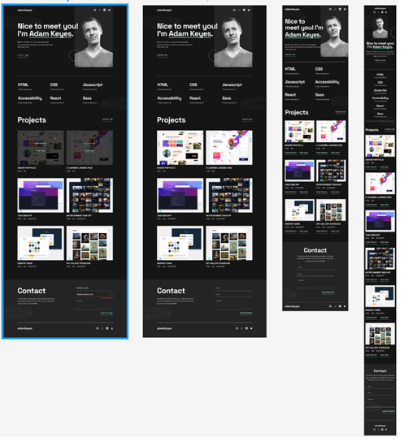

# 💼 Personal Web Portfolio

A responsive personal portfolio website designed to showcase projects, skills, and experience. The website is optimized for mobile, tablet, and desktop devices, ensuring a seamless browsing experience across all screen sizes.

## 🌐 Live Demo

🔗 https://evacristobal-dev.github.io/ResponsiveProject02/

## 👀 Preview



## ✨ Features

- 📱 Fully responsive design for mobile, tablet, and desktop devices.
- 🎨 Modern and clean user interface.
- 🏗️ Built with semantic HTML and Sass.
- 🖼️ Responsive images and optimized layouts.
- ⚡ Fast and lightweight performance.

## 🚀 Getting Started

Clone the repository:

```bash
git clone https://github.com/evacristobal-dev/ResponsiveProject02.git
```

Open `index.html` in your browser to view the project locally.
